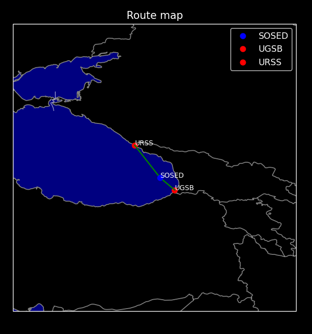
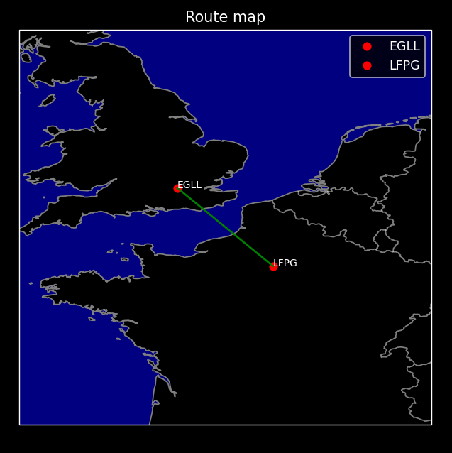
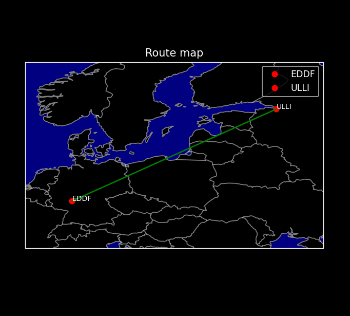
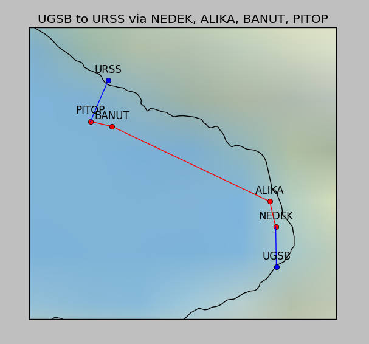

## ENG - Example of Work

  

## How to View the Code?

This project is private. For additional information, contact @xAvakov via Telegram.

## Can You Help?

If you have information on where to access the airspace routes database `(AIRAC)` that can be used to build route points, please contact @xAvakov via Telegram.

###

## Note

Description of the files and the files themselves are only in a private copy

The closed project uses the `MIT` license.

#

## RUS - Пример работы

  

## Как посмотреть код?

Этот проект находится в закрытом доступе, для дополнительной информации связавшись с @xAvakov через Telegram

## Можешь помочь?

Если вы обладаете информацией где можно получить доступ к базе данных воздушных трасс `(AIRAC)`, которую можно использовать для построения точек маршрута. Свяжитесь с @xAvakov через Telegram.

###

## Примечание

Описание файлов и сами файлы только в закрытой копии

Закртый проект использует лицензию `MIT` 